# Shopify AI Assistant – Embedded App for Conversational Commerces

An intelligent, AI-powered shopping assistant designed as a professional-grade Shopify embedded application. This solution leverages Google Gemini and Shopify APIs to provide a seamless conversational interface for product discovery, order management, and personalized customer engagement.

## 🧠 Architecture Overview

The system is designed with a clear separation of concerns, ensuring modularity and ease of integration:

- **Frontend (React Widget)**: A lightweight, responsive chat interface built with React and Tailwind CSS, utilizing Framer Motion for smooth animations and Shopify Polaris for a native look and feel.
- **Backend (Node API Layer)**: An Express-based server that handles API orchestration, security, and serves as a proxy for Shopify and AI services.
- **Shopify APIs (Admin + Storefront)**: Deep integration with Shopify's Admin API for real-time product data, order tracking, and store policies.
- **AI Layer (Gemini)**: Powered by Google Gemini 3.1 Pro, utilizing advanced tool-calling capabilities to interact with the Shopify ecosystem dynamically.
- **Webhooks (Real-time Updates)**: Designed to support Shopify webhooks for instant synchronization of inventory, orders, and customer data.

## 🚀 Scalability & Performance

- **Stateless Backend Architecture**: Designed for horizontal scaling, allowing multiple instances to handle high traffic without session affinity issues.
- **Webhook-based Event System**: Ensures real-time updates and reduces API polling overhead.
- **Lazy-loaded Chat Widget**: Optimized to load asynchronously, ensuring no impact on the core storefront's Core Web Vitals (LCP/FID).
- **API Response Caching**: Implements intelligent caching strategies for frequently accessed store data to minimize latency and AI processing costs.

## 🛡️ Security

- **Environment-based API Key Management**: Secure handling of sensitive credentials using environment variables and AI Studio secrets.
- **Shopify OAuth Ready**: Built with the foundation to support full Shopify OAuth flows for production-grade merchant authentication.
- **Rate Limiting**: Implemented on AI and Shopify proxy endpoints to prevent abuse and manage API quotas effectively.
- **Input Sanitization**: Robust validation and sanitization of user inputs to mitigate prompt injection and XSS risks.

## 📈 Business Impact

- **Improves Conversion Rate**: AI-driven personalized recommendations guide customers to the right products faster.
- **Reduces Support Workload**: Automates common queries like order tracking and policy information, freeing up human agents for complex tasks.
- **Increases Average Order Value (AOV)**: Proactive upselling and cross-selling suggestions based on real-time cart analysis.
- **Enhances User Engagement**: Provides a modern, conversational UI that builds trust and keeps customers on the site longer.

## 🚀 Features & Enhancements

- **Chat Widget Customization**: Merchants can now fully customize the chat widget's appearance, including primary and accent colors, font family, and screen position (bottom-right or bottom-left).
- **Dedicated Settings Page**: A comprehensive settings interface to manage AI system prompts, welcome messages, store details (name, description, support email), and chat widget themes.
- **Comprehensive Admin Dashboard**: Refactored with Shopify Polaris components for a professional, native-looking merchant experience. Includes dedicated tabs for:
    - **AI Insights**: Sentiment analysis, top queries, and performance trends with real-time charts.
    - **Customers & Orders**: Detailed tracking of customer interactions and AI-assisted sales.
    - **AI Configuration**: Granular control over model parameters (Temperature, Top P), system prompts, and safety settings.
    - **Automation & Campaigns**: Manage AI-driven workflows (e.g., cart recovery) and marketing campaigns.
    - **Team & Integrations**: Collaborative management and seamless connection with Shopify, Slack, Klaviyo, and more.
    - **System Logs**: Technical monitoring with searchable, filtered logs for production-level reliability.
- **Visual Feedback**: Implemented skeleton loaders and typing animations to provide clear feedback while the AI processes customer requests.
- **Storefront/Admin Toggle**: A seamless view switcher in the header for quick transitions between the customer-facing storefront and the merchant admin panel.
- **AI-Powered Product Discovery**: Advanced tool-calling integration for searching products, tracking orders, and providing personalized recommendations.

## 🛠️ Tech Stack

- **Frontend**: React 18, Tailwind CSS, Shopify Polaris, Framer Motion, Lucide React.
- **Backend**: Node.js, Express, Socket.IO for real-time communication.
- **AI**: Google Gemini 3.1 Pro (via `@google/genai`) with function calling.
- **Data Visualization**: Recharts for admin analytics.

## 🛡️ Security & Performance

- **Admin Authentication**: Secure access to merchant tools via password protection and custom headers.
- **Lazy-loaded Widget**: Optimized for performance to ensure zero impact on storefront load times.
- **API Proxying**: Secure handling of Shopify and Gemini API calls through the backend to protect sensitive credentials.

## Setup & Configuration

### Environment Variables
Declare the following variables in your environment or `.env` file:
- `GEMINI_API_KEY`: Your Google Gemini API key.
- `SHOPIFY_SHOP_NAME`: Your Shopify store name (e.g., `my-store`).
- `SHOPIFY_ACCESS_TOKEN`: Your Shopify Admin API access token.
- `ADMIN_PASSWORD`: Password for accessing the admin dashboard (default: `admin123`).

### Installation & Development
1. **Install dependencies**: `npm install`
2. **Start development server**: `npm run dev`
3. **Build for production**: `npm run build`

## Usage
- **Storefront**: Visit the root URL to interact with the AI assistant.
- **Admin Panel**: Click the "Admin View" toggle in the header or append `?admin=1` to the URL. Use the configured `ADMIN_PASSWORD` to log in.
- **Settings**: Navigate to the "Settings" tab in the Admin Panel to customize the AI's behavior and the widget's appearance.

## License
# Shopify-AI-Assistant-Embedded-App-for-Conversational-Commerces

